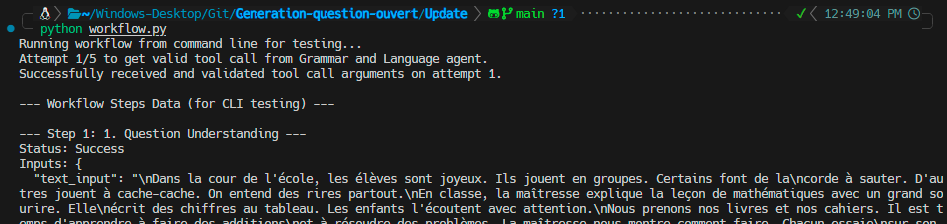

# Système d'Évaluation Automatisée des Réponses d'Élèves

      

Ce projet implémente un système automatisé pour évaluer les réponses d'élèves à des questions ouvertes, en tirant parti de Grands Modèles Linguistiques (LLM) orchestrés via un flux de travail multi-agents. Le système fournit une évaluation complète, incluant la compréhension du contenu, la notation basée sur une grille d'évaluation, l'analyse grammaticale et un feedback constructif.

## Architecture

Le système suit une architecture modulaire basée sur des agents, comme illustré dans le diagramme ci-dessous :


Le flux de travail est composé de plusieurs agents spécialisés qui traitent les entrées séquentiellement :

1.  **Agent de compréhension des questions**: Analyse le texte de contexte et la question pour déterminer le type de question, identifier les concepts clés attendus dans une réponse complète et définir les attentes de l'enseignant.
2.  **Agent d'extraction de rubriques**: Basé sur le contexte, la question et les concepts clés attendus, cet agent génère une grille d'évaluation détaillée. La grille définit les concepts, les mots-clés associés et leurs pondérations respectives, assurant un poids total de 100%.
3.  **Agent de compréhension des réponses**: Traite la réponse de l'élève en relation avec le contexte et la question. Il extrait les concepts trouvés dans la réponse, évalue leur pertinence et leur exhaustivité, calcule l'alignement sémantique global, identifie les entités nommées et les dates, et évalue la cohérence structurelle de la réponse.
4.  **Agent de grammaire et de langue**: Se concentre sur la qualité linguistique de la réponse de l'élève. Il identifie les erreurs grammaticales, les fautes d'orthographe, les problèmes d'accentuation et les problèmes stylistiques, en fournissant des suggestions de correction et en calculant une pénalité de qualité linguistique.
5.  **Agent d'évaluation**: Note la réponse de l'élève par rapport à la grille d'évaluation générée, en utilisant l'analyse sémantique détaillée de l'Agent de compréhension des réponses. Il attribue des scores pour chaque concept de la grille et calcule un score total basé sur l'exactitude et la couverture du contenu.
6.  **Agent de notation finale**: Combine le score basé sur la grille d'évaluation avec la pénalité grammaticale pour calculer un score numérique final. Il génère également un feedback détaillé et constructif pour l'élève, soulignant les points forts et les domaines à améliorer.

## Fonctionnement

Le système fonctionne comme une application web Streamlit, offrant une interface utilisateur intuitive pour l'interaction.


1.  **Entrée**: L'utilisateur fournit un texte de contexte, une question et une réponse d'élève via l'interface Streamlit.
2.  **Orchestration du flux de travail**: Le script `workflow.py` orchestre l'exécution séquentielle des agents. Chaque agent est appelé avec des entrées spécifiques dérivées des étapes précédentes. Un mécanisme de réessai est implémenté pour améliorer la robustesse contre les erreurs LLM transitoires ou les sorties mal formées.
3.  **Interaction LLM**: Tous les agents interagissent avec un Grand Modèle Linguistique (LLM) via l'utilitaire `Agents/llm.py`. Cet utilitaire gère l'envoi des invites et des instructions au LLM (spécifiquement, l'API Groq avec le modèle `gemma2-9b-it`) et traite les réponses du LLM, y compris les appels d'outils structurés.
4.  **Sortie structurée**: Chaque agent est conçu pour produire une sortie JSON structurée, imposée par des schémas d'outils prédéfinis. Cela garantit la cohérence et facilite le passage d'informations entre les différents agents.
5.  **Supervision étape par étape**: L'application Streamlit affiche la sortie et le statut de chaque étape du flux de travail, permettant aux utilisateurs de superviser le processus d'évaluation en temps réel.
    
    
6.  **Résultat final**: Une fois terminé, le système présente un score final et un feedback complet à l'élève.

## Structure du Codebase

Le projet est organisé dans les principaux répertoires et fichiers suivants :

*   `app.py`: Le fichier principal de l'application Streamlit, responsable de l'interface utilisateur, de la gestion des entrées et de l'affichage des résultats du flux de travail.
*   `workflow.py`: Orchestre l'ensemble du processus d'évaluation multi-agents. Il définit la séquence des appels d'agents, gère les réessais et gère le flux de données entre les agents.
*   `Agents/`: Ce répertoire contient des modules Python individuels pour chaque agent spécialisé.
    *   `Agents/llm.py`: Un module utilitaire pour interagir avec l'API Groq LLM, gérant la construction des invites, les appels API et les réponses d'appels d'outils structurés.
    *   `Agents/a_ans_understanding.py`: Implémente l'Agent de compréhension des réponses.
    *   `Agents/a_eval.py`: Implémente l'Agent d'évaluation.
    *   `Agents/a_final_eval.py`: Implémente l'Agent de notation finale.
    *   `Agents/a_grammar_language.py`: Implémente l'Agent de grammaire et de langue.
    *   `Agents/a_qst_understanding.py`: Implémente l'Agent de compréhension des questions.
    *   `Agents/a_rubric_extraction.py`: Implémente l'Agent d'extraction de rubriques.
*   `templates/`: Contient les modèles HTML, actuellement `index.html` (bien que son utilisation directe puisse être limitée dans une application Streamlit pure, il pourrait être destiné à l'intégration Flask si `flask-app.py` est actif).
*   `.env-example`: Un exemple de fichier pour les variables d'environnement, spécifiquement pour `GROQ_API_KEY`.
*   `.env`: (Non commité) Utilisé pour stocker les variables d'environnement réelles comme `GROQ_API_KEY`.
*   `flask-app.py`: (Facultatif/Alternatif) Un fichier d'application Flask, potentiellement pour un déploiement différent ou un point d'API, non directement utilisé par `app.py` de Streamlit dans sa forme actuelle.
    
    
    
*   `mongo.yml`: Un fichier YAML, probablement pour la configuration MongoDB, suggérant une intégration potentielle de base de données pour stocker des données (par exemple, des rubriques, des évaluations).
    
*   `requirements.txt`: Lists the Python dependencies required for the project.

## Configuration et Exécution

1.  **Cloner le dépôt**:
    ```bash
    git clone https://github.com/medamine-98/Generation-question-ouvert.git
    cd Generation-question-ouvert/Update
    ```
2.  **Configurer les variables d'environnement**:
    Créez un fichier `.env` à la racine du répertoire et ajoutez votre clé API Groq :
    ```
    GROQ_API_KEY='votre_clé_api_groq_ici'
    ```
    Alternativement, définissez-la comme variable d'environnement dans votre terminal :
    ```bash
    export GROQ_API_KEY='votre_clé_api_groq_ici'
    ```
3.  **Installer les dépendances**:
    (En supposant que vous avez `pip` et `venv` installés)
    ```bash
    python -m venv venv
    source venv/bin/activate  # Sous Windows: `venv\Scripts\activate`
    pip install -r requirements.txt # Vous devrez peut-être créer ce fichier d'abord
    ```
    *Note : Un fichier `requirements.txt` n'est pas fourni, mais les dépendances typiques incluraient `streamlit`, `groq`, `pandas`, `python-dotenv` (si vous utilisez un fichier .env).*
    Vous pouvez générer un `requirements.txt` en utilisant :
    ```bash
    pip freeze > requirements.txt
    ```
4.  **Exécuter l'application Streamlit**:
    ```bash
    streamlit run app.py
    ```
    Cela ouvrira l'application dans votre navigateur web.

### Workflow Command Line Testing




